# CLASS DIAGRAM - ỨNG DỤNG QUẢN LÝ CHI TIÊU CÁ NHÂN

## MỤC LỤC

1. Entity Classes (Thuộc tính từ Prisma + Phương thức từ fakeApi)
2. Quan hệ giữa các Classes

---

## PHẦN 1: ENTITY CLASSES (THUỘC TÍNH TỪ PRISMA + PHƯƠNG THỨC TỪ FAKEAPI)

### 1. User

**Thuộc tính (từ Prisma):**
```
+ id: Int
+ name: String
+ email: String
+ password: String
+ role: Int
+ is_active: Int
+ last_login: DateTime
+ created_at: DateTime
+ updated_at: DateTime
```

**Phương thức (từ fakeApi - AuthService, UserService, DashboardService):**
```
+ login(email: String, password: String): Promise<AuthResult>
+ register(email: String, password: String): Promise<AuthResult>
+ confirmEmail(email: String, otp: String): Promise<Result>
+ resetPassword(email: String): Promise<Result>
+ getCurrentUserId(): number
+ getUser(userId: number): Promise<User>
+ updateUser(userId: number, data: UserUpdate): Promise<Result>
+ updatePassword(userId: number, oldPassword: String, newPassword: String): Promise<Result>
+ getUserPreferences(userId: number): Promise<Preferences>
+ getSetupStatus(userId: number): Promise<SetupStatus>
+ getDashboardSummary(userId: number, timeRange: 'week' | 'month'): Promise<DashboardSummary>
+ getDashboardBarChartData(userId: number, timeRange: 'week' | 'month'): Promise<BarChartData>
+ getDashboardTopCategories(userId: number, timeRange: 'week' | 'month', limit: number): Promise<CategoryStats[]>
+ getDashboardPieChartData(userId: number, timeRange: 'week' | 'month'): Promise<PieChartData>
+ getDashboardRecentTransactions(userId: number, limit: number): Promise<Transaction[]>
```

Quan hệ:
- 1..* UserCategory (Composition)
- 1..* Wallet (Composition)
- 1..* Transaction (Composition)
- 1..* Budget (Composition)
- 1..* Streak (Composition)
- 1..* Notification (Composition)
- 1..* Report (Composition)
- 1..* LogUser (Composition)
- 1..* SavingsGoal (Composition)
- 1..* RecurringExpense (Composition)
- 1..* RecurringExpenseReminder (Composition)
- 1..* ChatMessage (Composition)
- 1 NotificationSettings (Composition)
- 1 StreakSettings (Composition)
- 1..* StreakHistory (Composition)

### 2. Category

**Thuộc tính (từ Prisma):**
```
+ id: Int
+ icon: String
+ name: String
+ type: Int
```

**Phương thức (từ fakeApi - CategoryService):**
```
+ getCategories(): Promise<Category[]>
```

Quan hệ: Không có quan hệ trực tiếp với các entity khác (là danh mục mặc định)

### 3. UserCategory

**Thuộc tính (từ Prisma):**
```
+ id: Int
+ user_id: Int
+ icon: String
+ name: String
+ type: Int
+ created_at: DateTime
+ updated_at: DateTime
```

**Phương thức (từ fakeApi - CategoryService):**
```
+ getUserCategories(userId: number): Promise<UserCategory[]>
+ addCategory(userId: number, name: String, type: number, icon?: String): Promise<Result>
+ getCategory(userId: number, categoryId: number): Promise<UserCategory>
+ updateCategory(userId: number, categoryId: number, data: CategoryUpdate): Promise<Result>
+ deleteCategory(userId: number, categoryId: number): Promise<Result>
```

Quan hệ:
- 1 User (Composition - từ user_id)
- 1..* Transaction (Association)
- 1..* Budget (Association)
- 1..* RecurringExpense (Association)

### 4. Wallet

**Thuộc tính (từ Prisma):**
```
+ id: Int
+ user_id: Int
+ name: String
+ amount: Int
+ currency: String
+ is_default: Int
+ created_at: DateTime
+ updated_at: DateTime
```

**Phương thức (từ fakeApi - WalletService):**
```
+ getWallets(userId?: number): Promise<Wallet[]>
+ getCurrentWalletId(userId?: number): Promise<WalletId>
+ setCurrentWallet(userId: number, walletId: number): Promise<Result>
+ createWallet(userId: number, name: String, amount: number, currency: String): Promise<Result>
+ getWallet(userId: number, walletId: number): Promise<Wallet>
+ updateWallet(userId: number, walletId: number, updates: WalletUpdate): Promise<Result>
+ setDefaultWallet(userId: number, walletId: number): Promise<Result>
+ transferBetweenWallets(userId: number, fromWalletId: number, toWalletId: number, amount: number, note?: String): Promise<Result>
+ deleteWallet(userId: number, walletId: number): Promise<Result>
+ updateWalletBalance(walletId: number, newAmount: number): Promise<Result>
+ getWalletDashboard(userId: number, walletId: number): Promise<WalletDashboard>
```

Quan hệ:
- 1 User (Composition - từ user_id)
- 1..* Transaction (Composition)
- 1..* Budget (Association)
- 1..* RecurringExpense (Association)

### 5. Transaction

**Thuộc tính (từ Prisma):**
```
+ id: Int
+ user_id: Int
+ wallet_id: Int
+ user_category_id: Int
+ amount: Int
+ transaction_date: DateTime
+ content: String
+ type: Int
+ created_at: DateTime
+ updated_at: DateTime
```

**Phương thức (từ fakeApi - TransactionService, AIService):**
```
+ getTransactions(userId: number, walletId?: number): Promise<Transaction[]>
+ addTransaction(userId: number, walletId: number, userCategoryId: number, amount: number, content: String, type: number, transactionDate?: String): Promise<Transaction>
+ createTransaction(userId: number, data: TransactionData): Promise<Transaction>
+ updateTransaction(userId: number, transactionId: number, data: TransactionUpdate): Promise<Result>
+ deleteTransaction(userId: number, transactionId: number): Promise<Result>
+ searchTransactions(userId: number, query: String, walletId?: number): Promise<Transaction[]>
+ getTransactionsList(userId: number, options: TransactionListOptions): Promise<TransactionListResult>
+ getTransactionsStatistics(userId: number, options: StatisticsOptions): Promise<Statistics>
+ exportTransactions(userId: number, format: 'csv' | 'json'): Promise<ExportResult>
+ getTransactionStats(userId: number): Promise<TransactionStats>
+ parseTextToTransactions(userId: number, text: String): Promise<ParseResult>
+ parseVoiceToTransactions(userId: number, audioFile?: any): Promise<ParseResult>
+ parseImageToTransactions(userId: number, imageUri: String): Promise<ParseResult>
+ parseQuickInput(userId: number, input: String): Promise<ParseResult>
+ createQuickTransactions(userId: number, transactions: TransactionData[], walletId?: number): Promise<Result>
```

Quan hệ:
- 1 User (Composition - từ user_id)
- 1 Wallet (Composition - từ wallet_id)
- 1 UserCategory (Association - từ user_category_id)

### 6. Budget

**Thuộc tính (từ Prisma):**
```
+ id: Int
+ user_id: Int
+ user_category_id: Int
+ wallet_id: Int
+ amount: Decimal
+ start_date: DateTime
+ end_date: DateTime
+ is_repeat: Int
+ created_at: DateTime
+ updated_at: DateTime
```

**Phương thức (từ fakeApi - BudgetService):**
```
+ getBudgets(userId: number, walletId?: number): Promise<Budget[]>
+ createBudget(userId: number, data: BudgetData): Promise<Budget>
+ updateBudget(userId: number, budgetId: number, data: BudgetUpdate): Promise<Result>
+ deleteBudget(userId: number, budgetId: number): Promise<Result>
+ getBudgetDetail(userId: number, budgetId: number): Promise<BudgetDetail>
+ getBudgetTransactions(userId: number, budgetId: number): Promise<Transaction[]>
+ runDailyBudgetWorker(nowOverride?: Date): Promise<Result>
+ checkBudgetAlerts(userId: number): Promise<Result>
```

Quan hệ:
- 1 User (Composition - từ user_id)
- 1 UserCategory (Association - từ user_category_id)
- 1 Wallet (Association - từ wallet_id)

### 7. Streak

**Thuộc tính (từ Prisma):**
```
+ id: Int
+ user_id: Int
+ streak_days: Int
+ last_transaction_date: DateTime
+ created_at: DateTime
+ updated_at: DateTime
```

**Phương thức (từ fakeApi - StreakService):**
```
+ getUserStreak(userId: number): Promise<Streak>
+ getStreakData(userId: number): Promise<StreakData>
+ recordStreakActivity(userId: number, activityType: String): Promise<Result>
+ getStreakStats(userId: number): Promise<StreakStats>
```

Quan hệ:
- 1 User (Composition - từ user_id)

### 8. Notification

**Thuộc tính (từ Prisma):**
```
+ id: Int
+ user_id: Int
+ type: String
+ title: String
+ message: String
+ data: Json
+ status: NotificationStatus
+ scheduled_for: DateTime
+ created_at: DateTime
+ updated_at: DateTime
```

**Phương thức (từ fakeApi - NotificationService):**
```
+ getNotifications(userId: number, page: number, limit: number): Promise<Notification[]>
+ markNotificationAsRead(userId: number, notificationId: number): Promise<Result>
+ markAllNotificationsAsRead(userId: number): Promise<Result>
+ deleteNotification(userId: number, notificationId: number): Promise<Result>
+ createNotification(userId: number, type: String, title: String, message: String, data?: any, scheduledFor?: String): Promise<Notification>
+ checkLargeTransactionAlerts(userId: number): Promise<Result>
+ generateWeeklyReport(userId: number): Promise<Result>
```

Quan hệ:
- 1 User (Composition - từ user_id)

### 9. Report

**Thuộc tính (từ Prisma):**
```
+ id: Int
+ user_id: Int
+ type: ReportType
+ start_date: DateTime
+ end_date: DateTime
+ created_at: DateTime
+ updated_at: DateTime
```

**Phương thức (từ fakeApi - ReportService):**
```
+ exportReportExcel(userId: number, filters: ReportFilters): Promise<ExportResult>
```

Quan hệ:
- 1 User (Composition - từ user_id)

### 10. SavingsGoal

**Thuộc tính (từ Prisma):**
```
+ id: Int
+ user_id: Int
+ name: String
+ target_amount: Int
+ current_amount: Int
+ deadline: DateTime
+ icon: String
+ color: String
+ currency: String
+ status: SavingsGoalStatus
+ created_at: DateTime
+ updated_at: DateTime
```

**Phương thức (từ fakeApi - SavingsGoalService):**
```
+ getSavingsGoals(userId: number): Promise<SavingsGoal[]>
+ getSavingsGoalDetail(userId: number, goalId: number): Promise<SavingsGoalDetail>
+ createSavingsGoal(userId: number, data: SavingsGoalData): Promise<SavingsGoal>
+ updateSavingsGoal(userId: number, goalId: number, data: SavingsGoalUpdate): Promise<Result>
+ deleteSavingsGoal(userId: number, goalId: number): Promise<Result>
+ addContribution(userId: number, goalId: number, amount: number, note?: String): Promise<Result>
```

Quan hệ:
- 1 User (Composition - từ user_id)
- 1..* SavingsGoalContribution (Composition)

### 11. SavingsGoalContribution

**Thuộc tính (từ Prisma):**
```
+ id: Int
+ goal_id: Int
+ amount: Int
+ note: String
+ created_at: DateTime
```

**Phương thức:** Không có phương thức riêng (được quản lý qua SavingsGoal)

Quan hệ:
- 1 SavingsGoal (Composition - từ goal_id)

### 12. RecurringExpense

**Thuộc tính (từ Prisma):**
```
+ id: Int
+ user_id: Int
+ wallet_id: Int
+ name: String
+ amount: Int
+ user_category_id: Int
+ frequency: RecurringFrequency
+ next_due_date: DateTime
+ is_active: Int
+ is_auto_detected: Int
+ confidence: Int
+ reminder_days_before: Int
+ note: String
+ created_at: DateTime
+ updated_at: DateTime
```

**Phương thức (từ fakeApi - RecurringExpenseService):**
```
+ detectRecurringExpenses(userId: number): Promise<RecurringPattern[]>
+ getRecurringExpenses(userId: number): Promise<RecurringExpense[]>
+ createRecurringExpense(userId: number, data: RecurringExpenseData): Promise<RecurringExpense>
+ updateRecurringExpense(userId: number, expenseId: number, data: RecurringExpenseUpdate): Promise<Result>
+ deleteRecurringExpense(userId: number, expenseId: number): Promise<Result>
+ predictNextMonthExpenses(userId: number): Promise<PredictionResult>
+ checkRecurringExpenseReminders(userId: number): Promise<Reminder[]>
```

Quan hệ:
- 1 User (Composition - từ user_id)
- 1 UserCategory (Association - từ user_category_id)
- 1 Wallet (Association - từ wallet_id)
- 1..* RecurringExpenseReminder (Composition)

### 13. RecurringExpenseReminder

**Thuộc tính (từ Prisma):**
```
+ id: Int
+ recurring_expense_id: Int
+ user_id: Int
+ scheduled_date: DateTime
+ is_notified: Int
+ created_at: DateTime
```

**Phương thức:** Không có phương thức riêng (được quản lý qua RecurringExpense)

Quan hệ:
- 1 RecurringExpense (Composition - từ recurring_expense_id)
- 1 User (Composition - từ user_id)

### 14. ChatMessage

**Thuộc tính (từ Prisma):**
```
+ id: String
+ user_id: Int
+ role: ChatRole
+ content: String
+ metadata: Json
+ created_at: DateTime
```

**Phương thức (từ fakeApi - ChatbotService):**
```
+ getChatHistory(userId: number): Promise<ChatMessage[]>
+ sendChatMessage(userId: number, content: String): Promise<ChatMessage>
```

Quan hệ:
- 1 User (Composition - từ user_id)

### 15. ChatFaq

**Thuộc tính (từ Prisma):**
```
+ id: String
+ question: String
+ answer: String
+ tags: String[]
```

**Phương thức (từ fakeApi - ChatbotService):**
```
+ getFAQs(): Promise<ChatFaq[]>
```

Quan hệ: Không có quan hệ với entity khác (dữ liệu độc lập)

### 16. NotificationSettings

**Thuộc tính (từ Prisma):**
```
+ id: Int
+ user_id: Int
+ budget_alerts: Int
+ transaction_reminders: Int
+ weekly_reports: Int
+ security_alerts: Int
+ push_enabled: Int
+ quiet_hours_enabled: Int
+ quiet_hours_start: String
+ quiet_hours_end: String
+ created_at: DateTime
+ updated_at: DateTime
```

**Phương thức (từ fakeApi - NotificationService):**
```
+ getNotificationSettings(userId: number): Promise<NotificationSettings>
+ updateNotificationSettings(userId: number, newSettings: NotificationSettingsUpdate): Promise<Result>
```

Quan hệ:
- 1 User (Composition - từ user_id)

### 17. StreakHistory

**Thuộc tính (từ Prisma):**
```
+ id: Int
+ user_id: Int
+ date: DateTime
+ has_activity: Int
+ activity_type: String
+ created_at: DateTime
```

**Phương thức (từ fakeApi - StreakService):**
```
+ getFullStreakHistory(userId: number): Promise<StreakHistory[]>
```

Quan hệ:
- 1 User (Composition - từ user_id)

### 18. StreakSettings

**Thuộc tính (từ Prisma):**
```
+ id: Int
+ user_id: Int
+ daily_reminder_enabled: Int
+ reminder_time: String
+ weekend_mode: Int
+ freeze_available: Int
+ freeze_used_this_week: Int
+ best_streak: Int
+ total_active_days: Int
+ created_at: DateTime
+ updated_at: DateTime
```

**Phương thức (từ fakeApi - StreakService):**
```
+ updateStreakSettings(userId: number, newSettings: StreakSettingsUpdate): Promise<Result>
+ useStreakFreeze(userId: number): Promise<Result>
+ recalculateStreak(userId: number): Promise<Result>
+ resetStreak(userId: number): Promise<Result>
+ checkDailyReminders(): Promise<Result>
+ checkStreakWarnings(): Promise<Result>
```

Quan hệ:
- 1 User (Composition - từ user_id)

### 19. LogUser

**Thuộc tính (từ Prisma):**
```
+ id: Int
+ user_id: Int
+ action: String
+ ip_address: String
+ created_at: DateTime
+ updated_at: DateTime
```

**Phương thức:** Không có phương thức riêng (chỉ ghi log)

Quan hệ:
- 1 User (Composition - từ user_id)

---

## PHẦN 2: QUAN HỆ GIỮA CÁC CLASSES

### Quan hệ Composition (Sở hữu mạnh)

1. User - UserCategory: 1..* (User sở hữu UserCategory)
2. User - Wallet: 1..* (User sở hữu Wallet)
3. User - Transaction: 1..* (User sở hữu Transaction)
4. User - Budget: 1..* (User sở hữu Budget)
5. User - Streak: 1..* (User sở hữu Streak)
6. User - Notification: 1..* (User sở hữu Notification)
7. User - Report: 1..* (User sở hữu Report)
8. User - LogUser: 1..* (User sở hữu LogUser)
9. User - SavingsGoal: 1..* (User sở hữu SavingsGoal)
10. User - RecurringExpense: 1..* (User sở hữu RecurringExpense)
11. User - RecurringExpenseReminder: 1..* (User sở hữu RecurringExpenseReminder)
12. User - ChatMessage: 1..* (User sở hữu ChatMessage)
13. User - NotificationSettings: 1..1 (User sở hữu NotificationSettings)
14. User - StreakSettings: 1..1 (User sở hữu StreakSettings)
15. User - StreakHistory: 1..* (User sở hữu StreakHistory)
16. Wallet - Transaction: 1..* (Wallet sở hữu Transaction)
17. SavingsGoal - SavingsGoalContribution: 1..* (SavingsGoal sở hữu SavingsGoalContribution)
18. RecurringExpense - RecurringExpenseReminder: 1..* (RecurringExpense sở hữu RecurringExpenseReminder)

### Quan hệ Association (Kết hợp)

1. UserCategory - Transaction: 1..* (UserCategory được sử dụng bởi Transaction)
2. UserCategory - Budget: 1..* (UserCategory được sử dụng bởi Budget)
3. UserCategory - RecurringExpense: 1..* (UserCategory được sử dụng bởi RecurringExpense)
4. Wallet - Budget: 1..* (Wallet được sử dụng bởi Budget)
5. Wallet - RecurringExpense: 1..* (Wallet được sử dụng bởi RecurringExpense)

### Quan hệ Dependency (Phụ thuộc)

Không có quan hệ Dependency riêng biệt vì các phương thức đã được tích hợp vào các class tương ứng.

---

## PHẦN 3: MÃ MERMAID ĐỂ VẼ SƠ ĐỒ CLASS DIAGRAM

```mermaid
classDiagram
    %% ===== ENTITY CLASSES (THUỘC TÍNH + PHƯƠNG THỨC) =====
    
    class User {
        +id: Int
        +name: String
        +email: String
        +password: String
        +role: Int
        +is_active: Int
        +last_login: DateTime
        +created_at: DateTime
        +updated_at: DateTime
        +login(): PromiseAuthResult
        +register(): PromiseAuthResult
        +confirmEmail(): PromiseResult
        +resetPassword(): PromiseResult
        +getCurrentUserId(): number
        +getUser(): PromiseUser
        +updateUser(): PromiseResult
        +updatePassword(): PromiseResult
        +getUserPreferences(): PromisePreferences
        +getSetupStatus(): PromiseSetupStatus
        +getDashboardSummary(): PromiseDashboardSummary
        +getDashboardBarChartData(): PromiseBarChartData
        +getDashboardTopCategories(): PromiseCategoryStats[]
        +getDashboardPieChartData(): PromisePieChartData
        +getDashboardRecentTransactions(): PromiseTransaction[]
    }
    
    class Category {
        +id: Int
        +icon: String
        +name: String
        +type: Int
        +getCategories(): PromiseCategory[]
    }
    
    class UserCategory {
        +id: Int
        +user_id: Int
        +icon: String
        +name: String
        +type: Int
        +created_at: DateTime
        +updated_at: DateTime
        +getUserCategories(): PromiseUserCategory[]
        +addCategory(): PromiseResult
        +getCategory(): PromiseUserCategory
        +updateCategory(): PromiseResult
        +deleteCategory(): PromiseResult
    }
    
    class Wallet {
        +id: Int
        +user_id: Int
        +name: String
        +amount: Int
        +currency: String
        +is_default: Int
        +created_at: DateTime
        +updated_at: DateTime
        +getWallets(): PromiseWallet[]
        +getCurrentWalletId(): PromiseWalletId
        +setCurrentWallet(): PromiseResult
        +createWallet(): PromiseResult
        +getWallet(): PromiseWallet
        +updateWallet(): PromiseResult
        +setDefaultWallet(): PromiseResult
        +transferBetweenWallets(): PromiseResult
        +deleteWallet(): PromiseResult
        +updateWalletBalance(): PromiseResult
        +getWalletDashboard(): PromiseWalletDashboard
    }
    
    class Transaction {
        +id: Int
        +user_id: Int
        +wallet_id: Int
        +user_category_id: Int
        +amount: Int
        +transaction_date: DateTime
        +content: String
        +type: Int
        +created_at: DateTime
        +updated_at: DateTime
        +getTransactions(): PromiseTransaction[]
        +addTransaction(): PromiseTransaction
        +createTransaction(): PromiseTransaction
        +updateTransaction(): PromiseResult
        +deleteTransaction(): PromiseResult
        +searchTransactions(): PromiseTransaction[]
        +getTransactionsList(): PromiseTransactionListResult
        +getTransactionsStatistics(): PromiseStatistics
        +exportTransactions(): PromiseExportResult
        +getTransactionStats(): PromiseTransactionStats
        +parseTextToTransactions(): PromiseParseResult
        +parseVoiceToTransactions(): PromiseParseResult
        +parseImageToTransactions(): PromiseParseResult
        +parseQuickInput(): PromiseParseResult
        +createQuickTransactions(): PromiseResult
    }
    
    class Budget {
        +id: Int
        +user_id: Int
        +user_category_id: Int
        +wallet_id: Int
        +amount: Decimal
        +start_date: DateTime
        +end_date: DateTime
        +is_repeat: Int
        +created_at: DateTime
        +updated_at: DateTime
        +getBudgets(): PromiseBudget[]
        +createBudget(): PromiseBudget
        +updateBudget(): PromiseResult
        +deleteBudget(): PromiseResult
        +getBudgetDetail(): PromiseBudgetDetail
        +getBudgetTransactions(): PromiseTransaction[]
        +runDailyBudgetWorker(): PromiseResult
        +checkBudgetAlerts(): PromiseResult
    }
    
    class Streak {
        +id: Int
        +user_id: Int
        +streak_days: Int
        +last_transaction_date: DateTime
        +created_at: DateTime
        +updated_at: DateTime
        +getUserStreak(): PromiseStreak
        +getStreakData(): PromiseStreakData
        +recordStreakActivity(): PromiseResult
        +getStreakStats(): PromiseStreakStats
    }
    
    class Notification {
        +id: Int
        +user_id: Int
        +type: String
        +title: String
        +message: String
        +data: Json
        +status: NotificationStatus
        +scheduled_for: DateTime
        +created_at: DateTime
        +updated_at: DateTime
        +getNotifications(): PromiseNotification[]
        +markNotificationAsRead(): PromiseResult
        +markAllNotificationsAsRead(): PromiseResult
        +deleteNotification(): PromiseResult
        +createNotification(): PromiseNotification
        +checkLargeTransactionAlerts(): PromiseResult
        +generateWeeklyReport(): PromiseResult
    }
    
    class Report {
        +id: Int
        +user_id: Int
        +type: ReportType
        +start_date: DateTime
        +end_date: DateTime
        +created_at: DateTime
        +updated_at: DateTime
        +exportReportExcel(): PromiseExportResult
    }
    
    class SavingsGoal {
        +id: Int
        +user_id: Int
        +name: String
        +target_amount: Int
        +current_amount: Int
        +deadline: DateTime
        +icon: String
        +color: String
        +currency: String
        +status: SavingsGoalStatus
        +created_at: DateTime
        +updated_at: DateTime
        +getSavingsGoals(): PromiseSavingsGoal[]
        +getSavingsGoalDetail(): PromiseSavingsGoalDetail
        +createSavingsGoal(): PromiseSavingsGoal
        +updateSavingsGoal(): PromiseResult
        +deleteSavingsGoal(): PromiseResult
        +addContribution(): PromiseResult
    }
    
    class SavingsGoalContribution {
        +id: Int
        +goal_id: Int
        +amount: Int
        +note: String
        +created_at: DateTime
    }
    
    class RecurringExpense {
        +id: Int
        +user_id: Int
        +wallet_id: Int
        +name: String
        +amount: Int
        +user_category_id: Int
        +frequency: RecurringFrequency
        +next_due_date: DateTime
        +is_active: Int
        +is_auto_detected: Int
        +confidence: Int
        +reminder_days_before: Int
        +note: String
        +created_at: DateTime
        +updated_at: DateTime
        +detectRecurringExpenses(): PromiseRecurringPattern[]
        +getRecurringExpenses(): PromiseRecurringExpense[]
        +createRecurringExpense(): PromiseRecurringExpense
        +updateRecurringExpense(): PromiseResult
        +deleteRecurringExpense(): PromiseResult
        +predictNextMonthExpenses(): PromisePredictionResult
        +checkRecurringExpenseReminders(): PromiseReminder[]
    }
    
    class RecurringExpenseReminder {
        +id: Int
        +recurring_expense_id: Int
        +user_id: Int
        +scheduled_date: DateTime
        +is_notified: Int
        +created_at: DateTime
    }
    
    class ChatMessage {
        +id: String
        +user_id: Int
        +role: ChatRole
        +content: String
        +metadata: Json
        +created_at: DateTime
        +getChatHistory(): PromiseChatMessage[]
        +sendChatMessage(): PromiseChatMessage
    }
    
    class ChatFaq {
        +id: String
        +question: String
        +answer: String
        +tags: String[]
        +getFAQs(): PromiseChatFaq[]
    }
    
    class NotificationSettings {
        +id: Int
        +user_id: Int
        +budget_alerts: Int
        +transaction_reminders: Int
        +weekly_reports: Int
        +security_alerts: Int
        +push_enabled: Int
        +quiet_hours_enabled: Int
        +quiet_hours_start: String
        +quiet_hours_end: String
        +created_at: DateTime
        +updated_at: DateTime
        +getNotificationSettings(): PromiseNotificationSettings
        +updateNotificationSettings(): PromiseResult
    }
    
    class StreakHistory {
        +id: Int
        +user_id: Int
        +date: DateTime
        +has_activity: Int
        +activity_type: String
        +created_at: DateTime
        +getFullStreakHistory(): PromiseStreakHistory[]
    }
    
    class StreakSettings {
        +id: Int
        +user_id: Int
        +daily_reminder_enabled: Int
        +reminder_time: String
        +weekend_mode: Int
        +freeze_available: Int
        +freeze_used_this_week: Int
        +best_streak: Int
        +total_active_days: Int
        +created_at: DateTime
        +updated_at: DateTime
        +updateStreakSettings(): PromiseResult
        +useStreakFreeze(): PromiseResult
        +recalculateStreak(): PromiseResult
        +resetStreak(): PromiseResult
        +checkDailyReminders(): PromiseResult
        +checkStreakWarnings(): PromiseResult
    }
    
    class LogUser {
        +id: Int
        +user_id: Int
        +action: String
        +ip_address: String
        +created_at: DateTime
        +updated_at: DateTime
    }
    
    %% ===== COMPOSITION RELATIONSHIPS =====
    
    User "1" *-- "*" UserCategory 
    User "1" *-- "*" Wallet 
    User "1" *-- "*" Transaction 
    User "1" *-- "*" Budget 
    User "1" *-- "*" Streak 
    User "1" *-- "*" Notification 
    User "1" *-- "*" Report 
    User "1" *-- "*" LogUser 
    User "1" *-- "*" SavingsGoal 
    User "1" *-- "*" RecurringExpense 
    User "1" *-- "*" RecurringExpenseReminder 
    User "1" *-- "*" ChatMessage 
    User "1" *-- "1" NotificationSettings 
    User "1" *-- "1" StreakSettings 
    User "1" *-- "*" StreakHistory 
    Wallet "1" *-- "*" Transaction 
    SavingsGoal "1" *-- "*" SavingsGoalContribution 
    RecurringExpense "1" *-- "*" RecurringExpenseReminder 
    
    %% ===== ASSOCIATION RELATIONSHIPS =====
    
    UserCategory "1" --> "*" Transaction 
    UserCategory "1" --> "*" Budget 
    UserCategory "1" --> "*" RecurringExpense 
    Wallet "1" --> "*" Budget 
    Wallet "1" --> "*" RecurringExpense 
```



---
